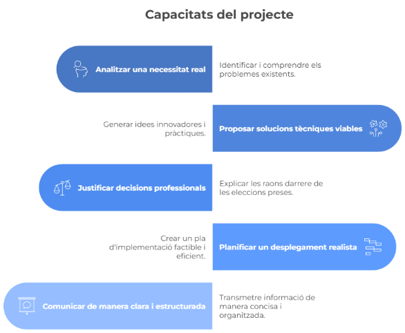

# P01: Memòria tècnica de la proposta

## Breu descripció

En aquest producte haureu d’elaborar la **memòria tècnica completa** de la proposta de solució per al client **FoodLogístic S.A.**.

Aquesta memòria serà el document principal que permetrà al client **entendre**, **valorar** i **validar** la vostra proposta abans de la seva implementació.

No es tracta només d’explicar què fareu, sinó de demostrar que sou capaços de documentar i presentar les capacitats del projecte.

Aquest document és una **evidència clau** del projecte, alineada amb la necessitat de **documentar tècnicament les solucions** i **transmetre informació de manera ordenada**, tal com exigeix el mòdul de **Projecte Intermodular**.

Aquesta memòria no serà només un document textual, sinó un **document tècnic ric, visual i estructurat**, com els que es troben en entorns professionals reals. Per tant, haureu de combinar:

- **redacció tècnica** en **Markdown**
- **representació visual** de la informació
- **evidències gràfiques i tècniques**
- **eines de documentació professional**

L’objectiu és que el client pugui:

- entendre la proposta
- visualitzar-la
- avaluar-ne la viabilitat
- prendre decisions

Aquesta memòria constitueix una **evidència fonamental** del projecte, ja que permet demostrar la capacitat de **documentar**, **justificar** i **comunicar** solucions tècniques de manera estructurada.

## Objectius específics de la tasca / Finalitat de la tasca

## Format de la memòria tècnica

### Format

- Document en **Markdown** (`README.md`)
- Ubicat dins la carpeta: **`/P01/`**
- Estructurat amb **encapçalaments clars**

### Repositori

- Lliurament a **GitHub Classroom**
- Ús obligatori de **control de versions**:
  - commits freqüents
  - missatges descriptius

### Ús d’elements visuals (**obligatori**)

La memòria ha d’incloure, com a mínim:

- **taules** per estructurar informació
- **diagrames** (arquitectura, xarxa, fluxos)
- **imatges i captures pròpies**
- **esquemes visuals**
- **badges** o indicadors visuals (**opcional però recomanat**)
- **llistes estructurades** i **blocs destacats**

> No s’acceptaran documents basats només en text.

## Estructura de la memòria i continguts exigits

A continuació es detalla què ha d’incloure cada apartat i en quin format.

## 1. Introducció

### Contingut obligatori

- context del projecte
- descripció del client
- objectius de la proposta

### Format esperat

- text estructurat
- llista de punts clau
- possible bloc destacat (`>`) amb resum executiu

### Es valorarà

- claredat
- capacitat de síntesi
- contextualització professional

## 2. Anàlisi de necessitats

### Contingut obligatori

- problemes detectats
- necessitats del client
- requisits tècnics

### Format esperat

- taula comparativa (**problema → impacte → solució**)
- llistes estructurades

### Es valorarà

- capacitat d’anàlisi
- relació clara **problema-solució**
- organització visual de la informació

## 3. Proposta de solució

### 3.1 Infraestructura i alta disponibilitat

#### Format obligatori

- text explicatiu
- diagrama d’arquitectura (**xarxa o serveis**)
- taula de components

#### Es valorarà

- coherència tècnica
- claredat del diagrama
- justificació de decisions

### 3.2 Serveis al núvol

#### Format obligatori

- taula comparativa (**Google Workspace vs Microsoft 365**, etc.)
- text justificatiu

#### Es valorarà

- capacitat de comparació
- argumentació tècnica

### 3.3 Seguretat i LOPD

#### Format obligatori

- llista de mesures de seguretat
- taula resum
- esquema o diagrama (**opcional però recomanat**)

#### Es valorarà

- rigor
- relació amb la normativa
- claredat

### 3.4 Presència web

#### Format obligatori

- wireframe o esquema de la web (**imatge o diagrama**)
- descripció funcional
- llista de requisits legals

#### Es valorarà

- claredat visual
- compliment normatiu
- enfocament pràctic

## 4. Arquitectura i disseny tècnic

### Contingut obligatori

- relació entre sistemes
- funcionament global

### Format obligatori

- diagrama global (**imprescindible**)
- esquemes o fluxos

### Possible ús d’eines

- **Draw.io**
- **Excalidraw**
- **Mermaid** (**opcional**)

### Es valorarà

- qualitat visual
- comprensibilitat
- coherència del sistema

## 5. Pressupost

### Contingut obligatori

- cost d’implantació
- costos recurrents

### Format obligatori

- taules detallades
- separació clara de conceptes

### Es valorarà

- realisme
- detall
- presentació clara

## 6. Planificació

### Contingut obligatori

- fases del projecte
- temps estimat

### Format obligatori

- taula de planificació
- diagrama de **Gantt** fet amb **UMLTREE**

Més informació:
[https://plantuml.com/es/gantt-diagram](https://plantuml.com/es/gantt-diagram)

### Es valorarà

- realisme
- organització
- capacitat de planificació

## 7. Conclusions

### Contingut obligatori

- valor de la proposta
- beneficis per al client

### Format esperat

- text sintètic
- llista de punts clau

### Es valorarà

- capacitat de síntesi
- orientació al client

---

A l'arxiu [solucio.md](solucio.md) hi ha la solució del producte final 1 

[Torna a la pàgina principal](../README.md)