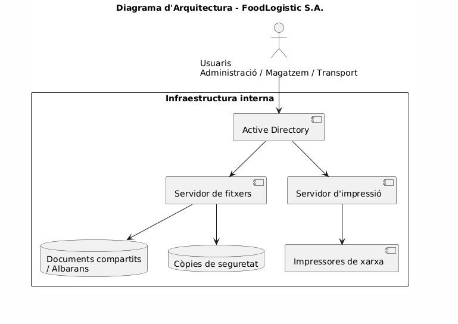
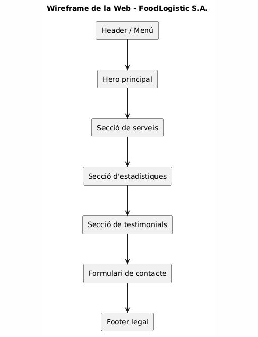
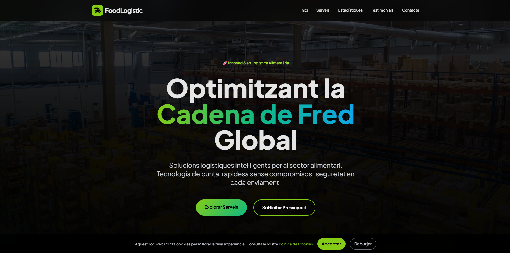
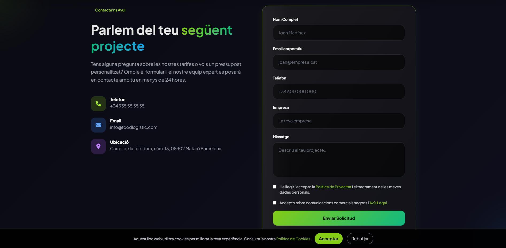
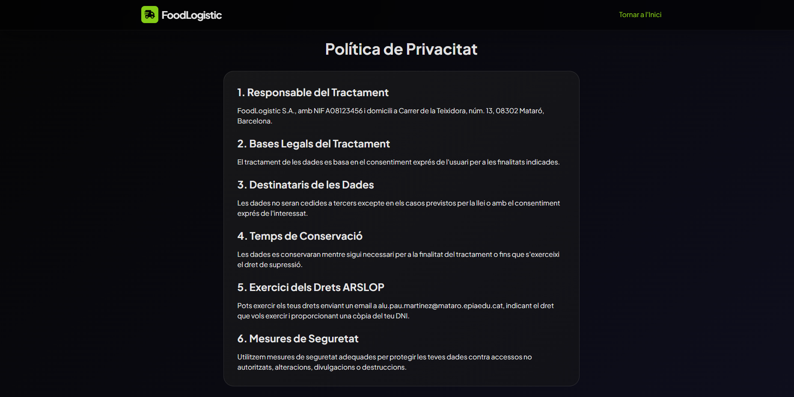
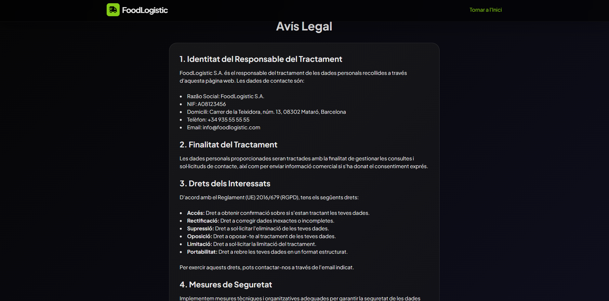
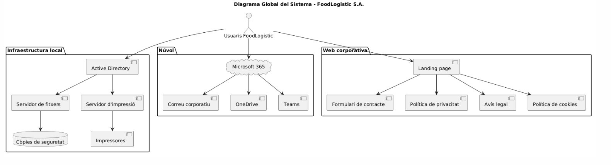
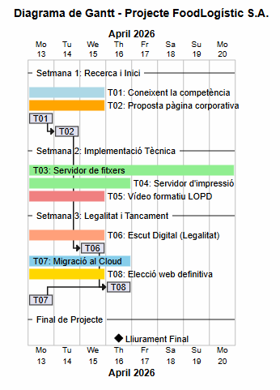

# P01: Memòria tècnica de la proposta

> **Resum executiu:** Aquesta memòria tècnica recull la proposta completa de modernització tecnològica per a **FoodLogistic S.A.**. La solució inclou millores en la infraestructura interna, migració a serveis al núvol, reforç de la seguretat i del compliment legal, renovació de la presència web i una planificació i pressupost realistes.

---

## Dades del projecte

| Camp | Valor |
|---|---|
| Raó social | FoodLogistic S.A. |
| NIF | A08123456 |
| Adreça | Carrer de la Teixidora, núm. 13, 08302 Mataró, Barcelona |
| Inscripció registral | Registre Mercantil de Barcelona, Tom 45678, Foli 120, Full B-567890, Inscripció 1a |
| Correu electrònic | info@foodlogistic.com |
| Telèfon | +34 935 55 55 55 |
| Nombre de treballadors | 35 |
| Facturació darrer any | 25 milions d’euros |
| Membres del grup | Biel Pérez i Pau Martínez |

---

# 1. Introducció

FoodLogistic S.A. és una empresa del sector de la logística alimentària amb seu a Mataró. A causa del creixement de l’activitat i de la necessitat de treballar de manera més eficient i segura, l’empresa necessita una modernització dels seus sistemes i de la seva imatge digital.

La nostra proposta no només planteja una solució tècnica, sinó també una proposta global orientada a millorar l’operativa, reforçar la seguretat, garantir el compliment legal i oferir una imatge corporativa més moderna i professional.

## Objectius de la proposta

- Millorar la disponibilitat dels serveis crítics.
- Centralitzar i optimitzar la gestió documental i d’impressió.
- Migrar el correu i la col·laboració a un entorn cloud estable.
- Formar el personal en protecció de dades.
- Crear una nova web corporativa moderna, útil i legalment adaptada.
- Presentar una solució viable tant a nivell tècnic com econòmic.

---

# 2. Anàlisi de necessitats

Després d’analitzar la situació inicial del client, hem identificat diversos problemes i necessitats que afecten tant l’operativa diària com la imatge i la seguretat de l’empresa.

| Problema detectat | Impacte | Solució proposada |
|---|---|---|
| Dependència de serveis interns poc optimitzats | Risc d’interrupcions i menor eficiència | Reforç del servidor de fitxers i d’impressió |
| Impressió crítica al magatzem | Una incidència pot afectar els enviaments | Servidor d’impressió centralitzat |
| Correu i col·laboració poc eficients | Problemes de comunicació interna | Migració a Microsoft 365 |
| Falta de consciència en protecció de dades | Risc legal i d’errors humans | Vídeo formatiu LOPD |
| Web corporativa millorable | Mala imatge i manca d’adaptació legal | Nova landing page corporativa |
| Falta d’elements legals a la web | Possible incompliment normatiu | Avís legal, privacitat, cookies i consentiment |

## Requisits tècnics principals

- Integració amb l’entorn intern de l’empresa.
- Gestió centralitzada de recursos.
- Solució cloud per a 35 treballadors.
- Compliment del RGPD, la LOPDGDD i la LSSI.
- Web corporativa responsive, moderna i funcional.
- Formulari de contacte amb consentiment exprés.

---

# 3. Proposta de solució

## 3.1 Infraestructura i alta disponibilitat

La proposta d’infraestructura se centra en reforçar els serveis crítics de FoodLogistic S.A., especialment el servidor de fitxers i el servidor d’impressió, ja que són essencials per al funcionament diari de l’empresa.

### Components de la infraestructura

| Component | Funció |
|---|---|
| Active Directory | Gestió centralitzada d’usuaris i permisos |
| Servidor de fitxers | Compartició segura de documents i albarans |
| Servidor d’impressió | Control de cues i impressores de xarxa |
| Còpies de seguretat | Protecció davant pèrdues de dades |

### Diagrama d’arquitectura

```bash
@startuml
title Diagrama d'Arquitectura - FoodLogistic S.A.

actor "Usuaris\nAdministració / Magatzem / Transport" as U

rectangle "Infraestructura interna" {
  component "Active Directory" as AD
  component "Servidor de fitxers" as SF
  component "Servidor d'impressió" as SI
  database "Documents compartits\n/ Albarans" as DOCS
  component "Impressores de xarxa" as PRN
  database "Còpies de seguretat" as BK
}

U --> AD
AD --> SF
AD --> SI
SF --> DOCS
SI --> PRN
SF --> BK

@enduml
```



### Justificació tècnica

Amb aquesta estructura, l’empresa pot centralitzar l’accés als documents, mantenir una millor organització dels recursos i reduir l’impacte de possibles incidències. La proposta és senzilla, realista i coherent amb les necessitats actuals del client.

---

## 3.2 Serveis al núvol

Per cobrir les necessitats de comunicació i col·laboració, hem comparat diferents alternatives cloud. Finalment, la millor opció per a FoodLogistic S.A. és **Microsoft 365 Business Standard**.

### Comparativa de serveis al núvol

| Servei | Avantatges | Inconvenients | Decisió |
|---|---|---|---|
| Microsoft 365 Business Standard | Outlook, Teams, OneDrive, Office, bona integració | Cost mensual per usuari | ✅ Escollit |
| Google Workspace | Entorn cloud molt flexible, Gmail i Drive | Menys integració amb entorns Microsoft | No escollit |

### Justificació

Hem triat Microsoft 365 perquè ofereix una solució completa per a 35 treballadors: correu corporatiu, emmagatzematge, treball col·laboratiu i eines de productivitat dins d’un mateix ecosistema. Això facilita la implantació i la continuïtat del servei.

---

## 3.3 Seguretat i LOPD

La seguretat del projecte es basa en dues línies principals: mesures tècniques i conscienciació del personal. Això es complementa amb la creació d’un vídeo formatiu perquè tots els treballadors coneguin les bones pràctiques en protecció de dades.

### Mesures de seguretat proposades

- Bloqueig de sessió als equips.
- Ús de contrasenyes robustes.
- Emmagatzematge només en entorns corporatius.
- Evitar l’ús de núvols personals.
- Control en l’ús de pendrives i dispositius USB.
- Impressió segura.
- Destrucció de documents amb trituradora.
- Formació interna sobre protecció de dades.
- Web adaptada amb avís legal, política de privacitat i política de cookies.

### Taula resum de mesures

| Àmbit | Mesura aplicada |
|---|---|
| Equips | Bloqueig de sessió i contrasenyes fortes |
| Dades digitals | Unitats corporatives i còpies de seguretat |
| Documents físics | Impressió segura i destrucció amb trituradora |
| Personal | Vídeo formatiu LOPD |
| Web | Consentiment exprés i textos legals obligatoris |

---

## 3.4 Presència web

La nova web de FoodLogistic S.A. s’ha plantejat com una **landing page corporativa moderna**, amb una imatge visual potent i una estructura clara. El disseny busca transmetre professionalitat, innovació i confiança.

### Descripció funcional

La web final inclou:

- Pàgina principal amb hero corporatiu.
- Secció de serveis.
- Secció d’estadístiques.
- Secció de testimonials.
- Formulari de contacte.
- Avís legal.
- Política de privacitat.
- Política de cookies.
- Banner de cookies.
- Consentiment exprés al formulari.

### Requisits legals incorporats

- Avís legal
- Política de privacitat
- Política de cookies
- Banner de cookies
- Checkbox obligatòria de tractament de dades
- Checkbox opcional per a comunicacions comercials

### Wireframe / esquema de la web

```bash
@startuml
title Wireframe de la Web - FoodLogistic S.A.

rectangle "Header / Menú" as H
rectangle "Hero principal" as HERO
rectangle "Secció de serveis" as SERV
rectangle "Secció d'estadístiques" as STATS
rectangle "Secció de testimonials" as TESTI
rectangle "Formulari de contacte" as CONTACT
rectangle "Footer legal" as LEGAL

H --> HERO
HERO --> SERV
SERV --> STATS
STATS --> TESTI
TESTI --> CONTACT
CONTACT --> LEGAL

@enduml
```



### Captures de la web definitiva

#### Pàgina principal


#### Formulari de contacte


#### Política de privacitat


#### Avís legal


### Enllaços del projecte web

- **Web individual de Biel:** https://bieel77.github.io/FoodLogistic/
- **Web individual de Pau:** https://paumartinezs.github.io/FoodLogistic-Pau/
- **Web definitiva del grup:** https://classessmx2n.github.io/web-projecte7-bieel77/

---

# 4. Arquitectura i disseny tècnic

Aquest apartat mostra la relació global entre tots els sistemes proposats. La solució final connecta la infraestructura local, els serveis al núvol i la presència web dins d’una mateixa arquitectura coherent.

## Funcionament global del sistema

- Els usuaris accedeixen als recursos interns mitjançant la infraestructura corporativa.
- El servidor de fitxers gestiona documents i albarans compartits.
- El servidor d’impressió controla les impressores de xarxa.
- Microsoft 365 cobreix el correu i la col·laboració.
- La web corporativa actua com a canal públic i comercial.
- El formulari de contacte i els textos legals garanteixen el compliment normatiu.

## Diagrama global

```bash
@startuml
title Diagrama Global del Sistema - FoodLogistic S.A.

actor "Usuaris FoodLogistic" as U

package "Infraestructura local" {
  component "Active Directory" as AD
  component "Servidor de fitxers" as SF
  component "Servidor d'impressió" as SI
  database "Còpies de seguretat" as BK
  component "Impressores" as PR
}

package "Núvol" {
  cloud "Microsoft 365" as M365
  component "Correu corporatiu" as MAIL
  component "OneDrive" as OD
  component "Teams" as TEAMS
}

package "Web corporativa" {
  component "Landing page" as WEB
  component "Formulari de contacte" as FORM
  component "Política de privacitat" as PRIV
  component "Avís legal" as AVIS
  component "Política de cookies" as COOKIES
}

U --> AD
AD --> SF
AD --> SI
SF --> BK
SI --> PR

U --> M365
M365 --> MAIL
M365 --> OD
M365 --> TEAMS

U --> WEB
WEB --> FORM
WEB --> PRIV
WEB --> AVIS
WEB --> COOKIES

@enduml
```



---

# 5. Pressupost

La proposta econòmica s’ha calculat a partir de les hores reals estimades per a cada tasca i aplicant una tarifa de **30 €/h**. També s’han inclòs els costos recurrents principals associats a la solució proposada.

## 5.1 Cost d’implantació

| Tasca | Hores | Cost base |
|---|---:|---:|
| T01 Coneixent la competència | 3 h | 90,00 € |
| T02 Proposta pàgina corporativa | 3 h | 90,00 € |
| T03 Servidor de fitxers | 8 h | 240,00 € |
| T04 Servidor d’impressió | 4 h | 120,00 € |
| T05 Vídeo formatiu LOPD | 3 h | 90,00 € |
| T06 Escut Digital | 3 h | 90,00 € |
| T07 Migració al cloud | 4 h | 120,00 € |
| T08 Elecció web definitiva | 3 h | 90,00 € |

### Resum del cost d’implantació

| Concepte | Import |
|---|---:|
| Base imposable | 930,00 € |
| IVA (21%) | 195,30 € |
| **Total implantació** | **1.125,30 €** |

---

## 5.2 Costos recurrents

| Servei | Cost base mensual | IVA | Total mensual |
|---|---:|---:|---:|
| Microsoft 365 Business Standard (35 usuaris) | 378,00 € | 79,38 € | 457,38 € |
| Hosting + domini | 6,00 € | 1,26 € | 7,26 € |
| Suport i manteniment preventiu | 120,00 € | 25,20 € | 145,20 € |

### Resum del cost recurrent

| Concepte | Import |
|---|---:|
| **Total mensual** | **609,84 € / mes** |
| **Total anual** | **7.318,08 € / any** |

### Justificació de la proposta econòmica

El pressupost s’ha plantejat amb criteris realistes i ajustats al projecte. La tarifa per hora aplicada és coherent amb una proposta tècnica d’implantació i consultoria. La solució Microsoft 365 s’ha escollit pel valor que aporta en comunicació i col·laboració, i el hosting triat és suficient per a una landing page corporativa. La quota de manteniment mensual cobreix suport, actualitzacions i prevenció d’incidències.

---

# 6. Planificació

La planificació del projecte s’ha distribuït en tres setmanes, seguint un ordre lògic i realista.

## Distribució temporal

| Setmana | Tasques principals |
|---|---|
| Setmana 1 | T01 Coneixent la competència, T02 Proposta pàgina corporativa |
| Setmana 2 | T03 Servidor de fitxers, T04 Servidor d’impressió, T05 Vídeo formatiu LOPD |
| Setmana 3 | T06 Escut Digital, T07 Migració al cloud, T08 Elecció web definitiva |

## Diagrama de Gantt



---

# 7. Conclusions

La proposta elaborada per a FoodLogistic S.A. respon de manera global a les necessitats detectades durant l’anàlisi del projecte. La combinació de millores en infraestructura, migració al núvol, reforç de la seguretat i renovació de la presència web permet oferir una solució coherent, escalable i orientada al client.

## Beneficis principals per al client

- Millora de l’organització interna.
- Més eficiència en la gestió documental i d’impressió.
- Comunicació corporativa més estable.
- Compliment legal més complet.
- Nova imatge digital més moderna i professional.
- Proposta econòmica i temporal realista.

En conclusió, considerem que aquesta proposta és viable, útil i adequada per a les necessitats actuals de FoodLogistic S.A., i que aporta una bona base per al seu futur creixement.

---

[Torna a l'enunciat](README.md)

[Torna a la pàgina principal](../README.md)