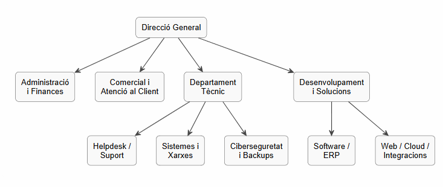

# T01: Coneixent la competència i el sector

## Introducció

Hem creat una empresa de serveis informàtics a Mataró i volem aconseguir com a client **FoodLogístic S.A.**, una empresa de logística alimentària situada al Polígon de les Hortes del Camí Ral.

Abans de presentar una proposta, cal analitzar la competència del sector, entendre com s’organitzen aquestes empreses i definir una estratègia clara per diferenciar-nos.

---

# Fase 1: Coneixent el terreny i la competència

## 1. Recerca de mercat

Hem analitzat tres empreses reals de serveis informàtics de Mataró o del Maresme.

| Empresa | Ubicació | Mida | Serveis principals |
|---|---|---|---|
| Digitalnet | Mataró | Microempresa | manteniment informàtic, suport tècnic, servidors, cloud, xarxes i VPN |
| Sintelec | Mataró | Microempresa | integració de sistemes, xarxes, ciberseguretat, helpdesk, manteniment i telecomunicacions |
| Extreme Micro | Mataró | Microempresa | reparació d’equips, xarxes, còpies de seguretat, seguretat informàtica, hosting i desenvolupament web |

### Anàlisi breu de la competència

Després d’analitzar aquestes empreses, observem que la competència local està formada principalment per **microempreses** que ofereixen serveis molt semblants:

manteniment informàtic
suport tècnic
sistemes i xarxes
cloud
ciberseguretat
desenvolupament web o software

Això vol dir que, per destacar, no n’hi ha prou amb oferir serveis informàtics generals, sinó que cal presentar una proposta de valor clara i adaptada al client.

---

## 2. Empresa escollida per fer l’organigrama

L’organigrama **no correspon exactament a una sola empresa concreta**, sinó que representa una **empresa tipus de serveis informàtics** basada en l’anàlisi de diverses empreses del sector de Mataró i el Maresme.

Hem triat aquesta opció perquè és més realista i reflecteix millor l’estructura habitual d’una empresa petita o microempresa de serveis TIC.

---

## 3. Organigrama de l’empresa tipus

A continuació es mostra el resultat final de l’organigrama:



### Estructura en arbre

text
Direcció / Gerència
├── Administració i Finances
├── Comercial i Atenció al Client
├── Departament Tècnic
│   ├── Helpdesk / Suport
│   ├── Sistemes i Xarxes
│   └── Ciberseguretat i Backups
└── Desenvolupament i Solucions
    ├── Software / ERP
    └── Web / Cloud / Integracions


## 4. Codi PlantUML de l’organigrama

```
@startuml
top to bottom direction
skinparam backgroundColor white
skinparam shadowing false
skinparam defaultTextAlignment center
skinparam ArrowThickness 1.2
skinparam ArrowColor #444444
skinparam rectangle {
  BackgroundColor #F9F9F9
  BorderColor #444444
  RoundCorner 12
}

rectangle "Direcció / Gerència" as DG
rectangle "Administració\ni Finances" as AF
rectangle "Comercial i\nAtenció al Client" as CAC
rectangle "Departament\nTècnic" as DT
rectangle "Desenvolupament\ni Solucions" as DS

rectangle "Helpdesk /\nSuport" as HD
rectangle "Sistemes i\nXarxes" as SX
rectangle "Ciberseguretat\ni Backups" as CB
rectangle "Software /\nERP" as SE
rectangle "Web / Cloud /\nIntegracions" as WCI

DG --> AF
DG --> CAC
DG --> DT
DG --> DS

DT --> HD
DT --> SX
DT --> CB

DS --> SE
DS --> WCI
@enduml
```

## 5. Funcions dels departaments

- **Direcció / Gerència:** coordina l’empresa i pren les decisions principals.
- **Administració i Finances:** gestiona pressupostos, factures, compres i pagaments.
- **Comercial i Atenció al Client:** capta clients i manté la relació amb ells.
- **Departament Tècnic:** s’encarrega del manteniment i de les incidències tècniques.
- **Helpdesk / Suport:** resol problemes quotidians d’usuaris, equips i accessos.
- **Sistemes i Xarxes:** administra servidors, xarxes, Wi-Fi i infraestructura.
- **Ciberseguretat i Backups:** protegeix les dades amb mesures de seguretat i còpies.
- **Desenvolupament i Solucions:** implanta software, ERP, webs i integracions.


# Fase 2: Estratègia

## 6. Definició de l’estratègia

Per competir amb altres empreses de serveis informàtics de Mataró i el Maresme, la nostra proposta de valor es basa en:

- **proximitat**, perquè som una empresa local i podem donar una atenció més directa
- **resposta ràpida**, tant en suport remot com presencial
- **atenció personalitzada**, adaptant-nos a les necessitats de FoodLogístic S.A.
- **manteniment preventiu**, per evitar problemes abans que afectin l’activitat
- **seguretat i continuïtat del servei**, per protegir les dades i garantir que l’empresa pugui treballar sense interrupcions

La nostra estratègia no és només resoldre incidències, sinó convertir-nos en un proveïdor de confiança a llarg termini.

### Proposta resumida

 No oferim només suport informàtic, sinó una solució de confiança perquè FoodLogístic S.A. pugui treballar amb seguretat, rapidesa i continuïtat.

---

## 7. Recursos humans necessaris

Per donar servei a un client com FoodLogístic S.A., considerem necessari comptar amb els perfils següents:

- **1 responsable de projecte o compte**, per coordinar el servei i mantenir el contacte amb el client
- **1 tècnic/a de sistemes i xarxes**, per gestionar servidors, xarxes i infraestructura
- **1 tècnic/a de suport / helpdesk**, per resoldre incidències del dia a dia
- **1 perfil de ciberseguretat i backups**, per protegir les dades i assegurar les còpies de seguretat
- **1 perfil de software / ERP / integracions**, per adaptar les eines informàtiques a les necessitats del client
- **1 suport administratiu o comercial**, per a pressupostos, seguiment i gestió bàsica

### Valoració de l’equip

Si l’empresa només té una o dues persones, **no seria suficient** per donar un servei complet i ràpid a un client d’aquesta mida.

Per això, la millor opció seria:

ampliar l’equip, o bé 
combinar personal intern amb col·laboradors externs especialitzats

Això permetria oferir un servei més professional, estable i de qualitat.

---

[Torna a l'enunciat](README.md)

[Torna a la pàgina principal](../README.md)

