# T03: Servidor de fitxers

IMPORTANT

Abans de crear la màquina virtual, afegim de primera interfície “NAT” i de segona  
“Adaptador pont”.

En primer lloc, instal·lem “l’Active Directory Domain Services” i creem el nou domini.

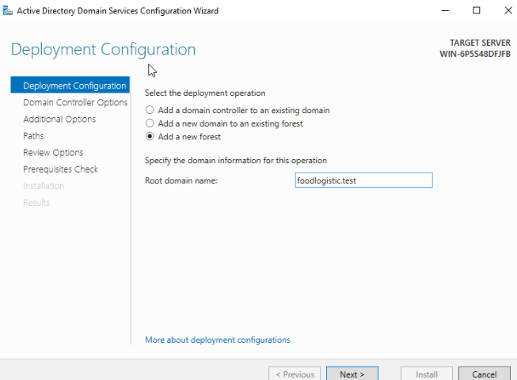

Li afegim contrasenya del “DSRM”.

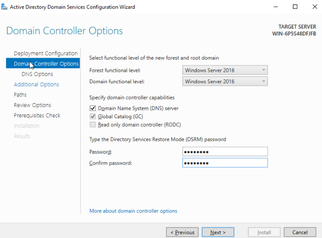

I acabem d’instal·lar el domini, seguint els passos que vagi demanant.

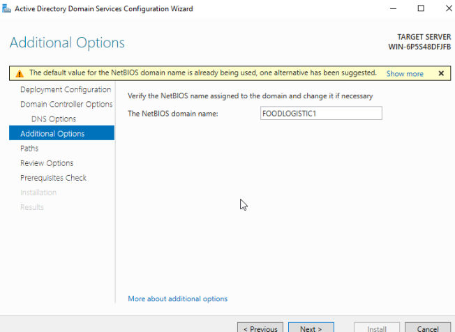

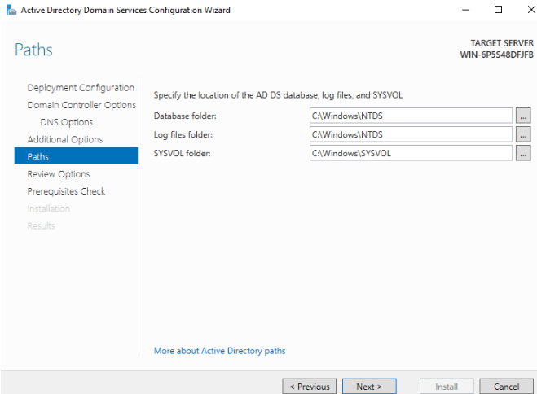

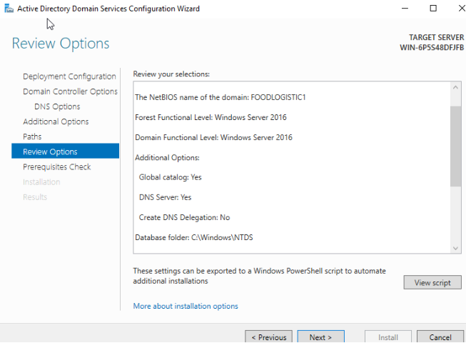

Un cop creat el domini, afegim un nou rol del servidor anomenat “File Server Resource  
Manager”.

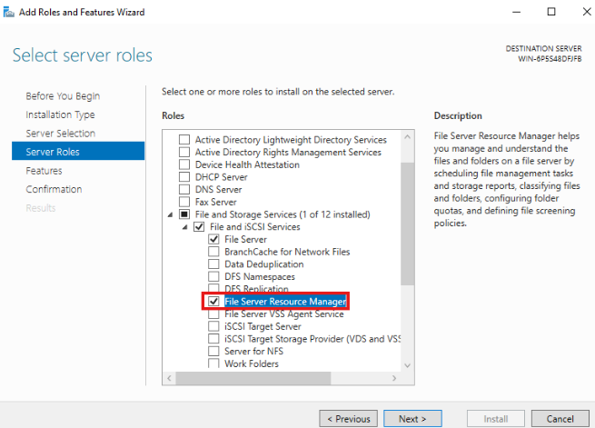

Un cop creat aquest dos rols, crearem la estructura de les OUs.

Consisteixen en:

Administracio: Gestió de factures i albarans.
Transport: Xofers i caps de flota.
Direccio: Gerència.

---

Creem dos OUs, una per usuaris i l’altre per grups.

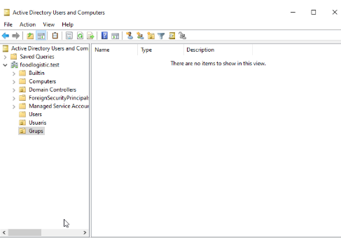

Dintre de la OU de “Grups”, creem els grups demanats:

Administracio
Transport
Direccio

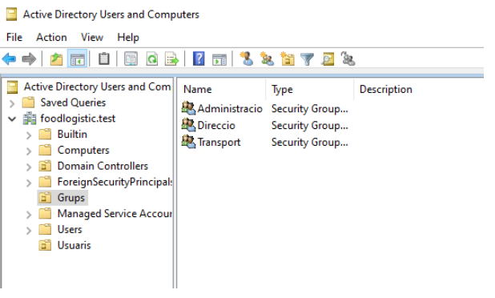

## 2. Implementació de Recursos Compartits (Tres mètodes)

Heu de crear les següents estructures de carpetes al servidor, cadascuna amb un mètode diferent:

### A. Carpeta Public (Mètode: Explorador d'arxius)

Compartiu-la per a tothom.
Configuració: Permisos SMB de "Lectura" i permisos NTFS de "Modificació". Verifiqueu la combinació de permisos efectiva.

IMPORTANT: LA CARPETA “PÚBLIC” ES DIU “CARPETA COMPARTIDA”.

Creem una carpeta dintre del disc “C”.

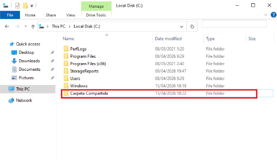

Anem a “Properties” > “Security” > i donem permisos de escritura a tothom.

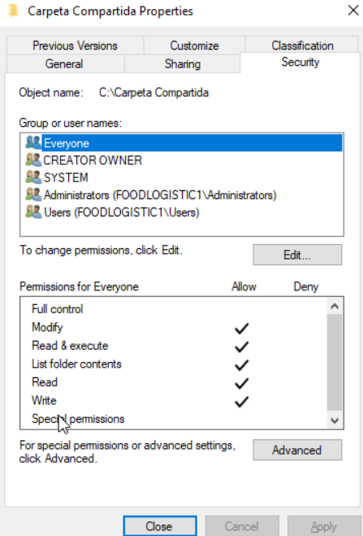

Compartim la carpeta desde “Properties” > “Sharing” > “Advanced Sharing” i compartim la carpeta.

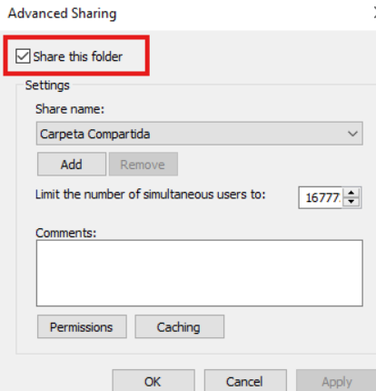

Donem permisos de lectura a tothom.

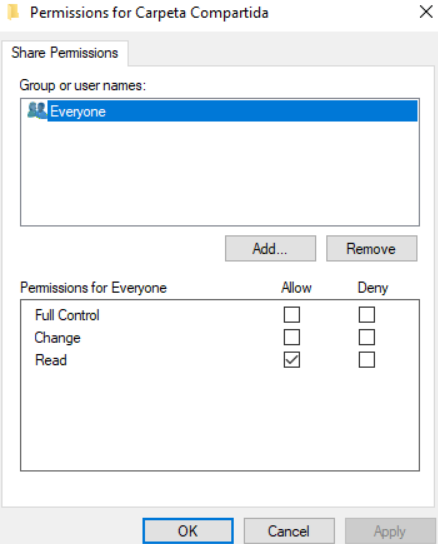

### B. Carpeta Operacions (Mètode: Server Manager - FSSM)

Instal·leu el rol File and Storage Services si no hi és.
Creeu el recurs compartit.
Fer que només es mostri pels usuaris amb accés (Acces-Based Enumeration).
Restricció: Només el grup Transport hi pot accedir.

Creem una carpeta al disc c que es digui Operacions

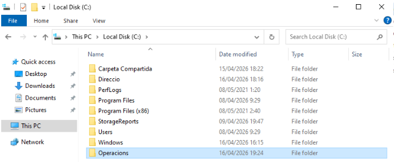

Entrem al server i anem a l’apartat “Shares” > “New share”.

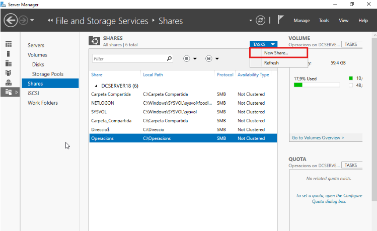

Seleccionem la opció de “SMB Share - Quick”.

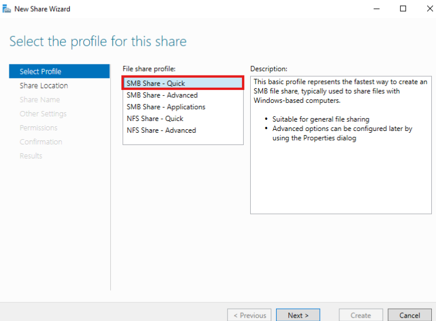

Seleccionem la carpeta Operacions.

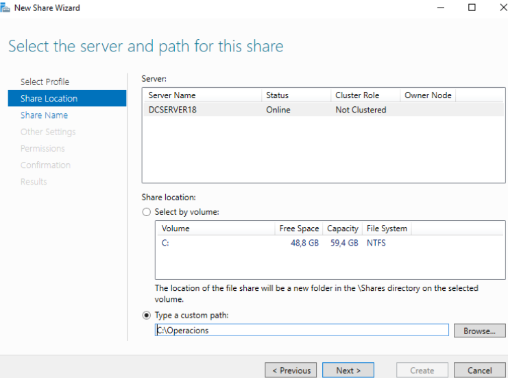

Li afegim un nom, en el meu cas “Operacions”.

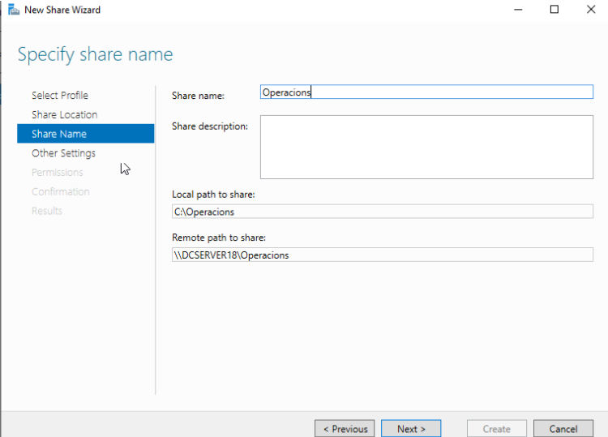

Tenim diverses configuracions de tipus de compartiment, només activem la opció “Enable  
acces-based enumeration” perquè unicament vegi les carpetes a les que té permisos.

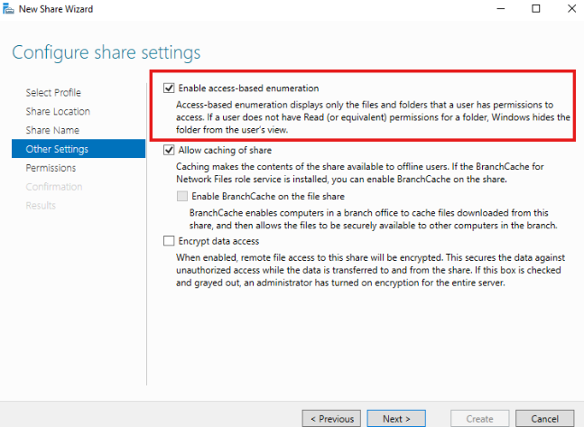

Editem els permisos perquè el grup transports, sigui l’únic grup que tingi accés a la carpeta.

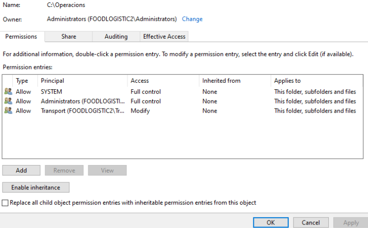

Prenem “Create”.

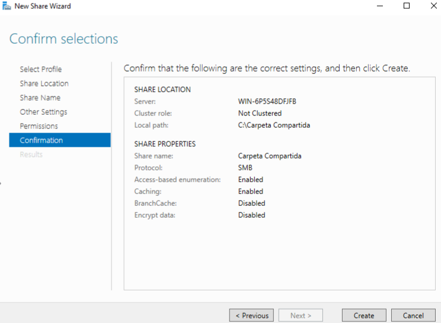

Resultats de la compartició:

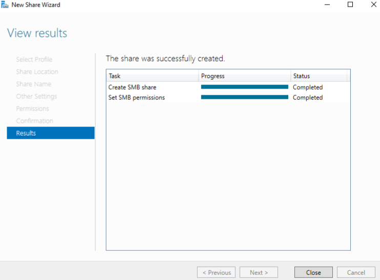

### C. Carpeta Confidencial (Mètode: PowerShell bàsic)

Creeu la carpeta Direccio$ (recurs ocult).
Restricció: només hi pot accedir el grup Direccio.
Utilitzeu el cmdlet New-SmbShare per compartir-la.
Configureu una GPO perquè aquesta carpeta aparegui automàticament com a unitat Z:
  només als usuaris de Direcció.

En primer lloc creem una carpeta anomenada “Direccio” al disc C.

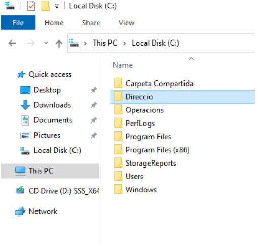

Ara entrem a Powershell com a administrador i introduï la següent comanda per donar  
permisos només al grup “Direccio”.

bash
`New-SmbShare -Name “Direccio$” -Path “C:\Direccio” -FullAccess “Direccio”.`

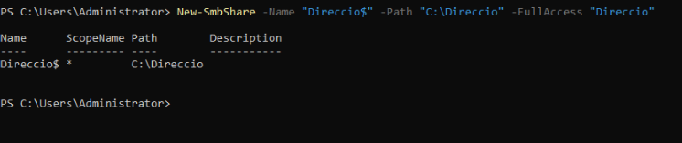

Anem a propietats de la carpeta , “Sharing” > Advanced Sharing” , comprovem que la  
carpeta és oculta.

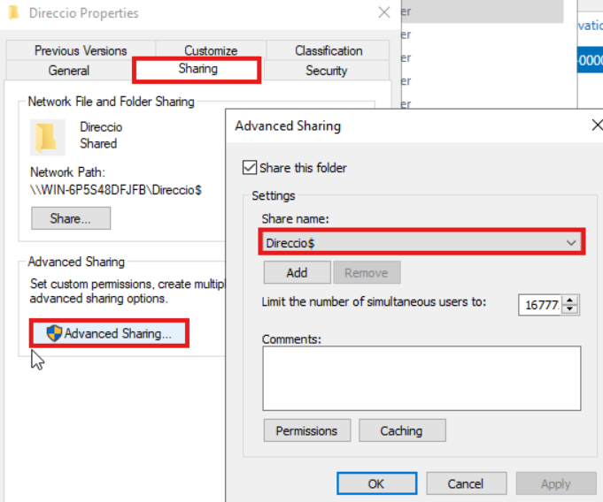

Tambe anem a “Security” per veure que nomes te permisos el grup “Direccio”

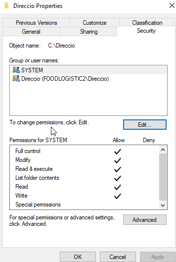

Anem al explorador de fitxer, “Network” > “Map network drive”.

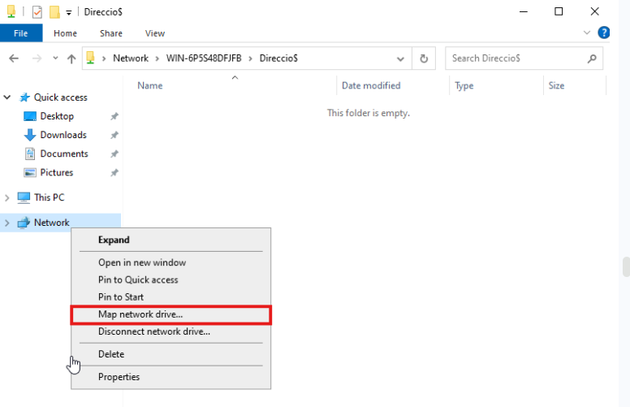

Afegim la lletra del disc i la seva ruta corresponent.

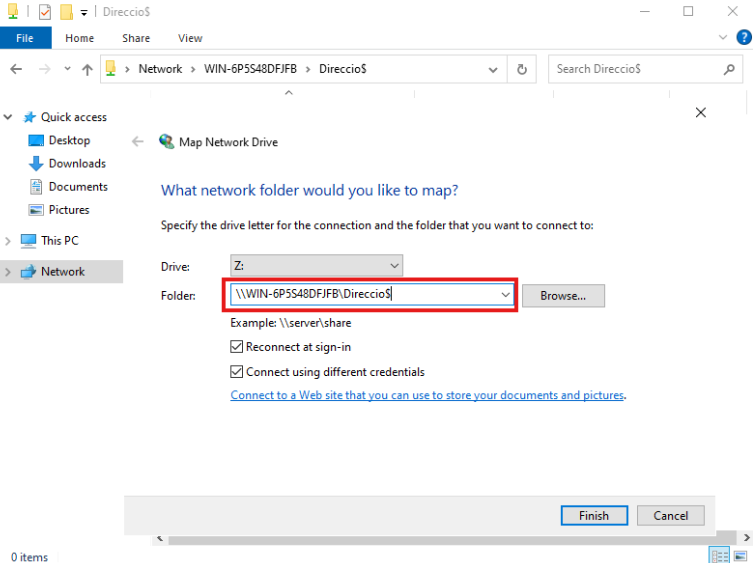

Ara configurarem una politica (GPO) perquè aquesta carpeta aparegui automàticament com a unitat  
Z: només als usuaris de Direcció.

Entrem a les GPO (Gorup Policy Managment) i entrem al següent arxiu.

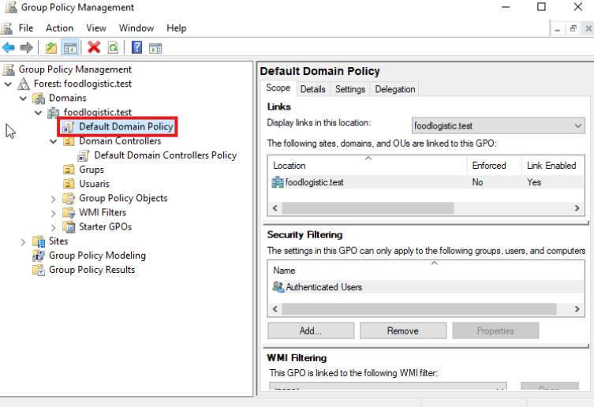

Seguim la mateixa ruta i afegim un “Mapped Drive”.

User Configuration > Preferences > Windows Settings > Drive Maps > New > Mapped Drive

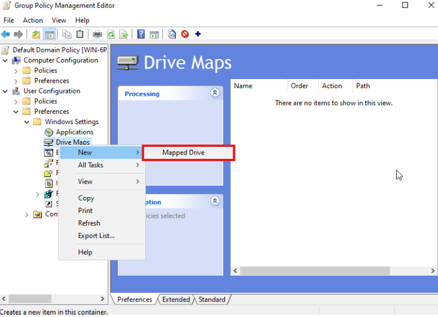

Copiem la mateixa configuració.

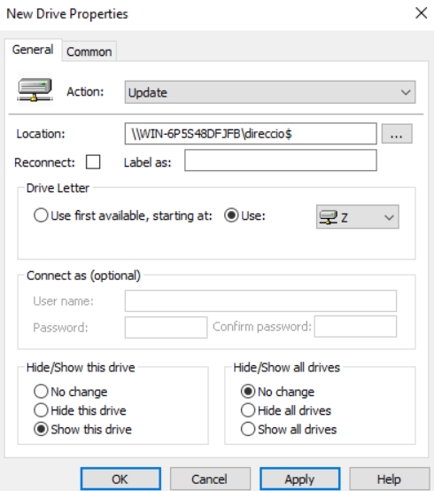

Tornem a entrar a l’arxiu i anem a la següent ruta:

Computer Configuration > Preferences > Windows Settings > Network Shares i en creem una xarxa compartida.

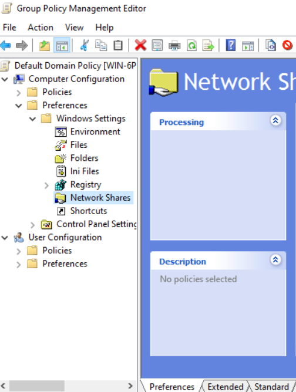

Copiem la següent configuració.

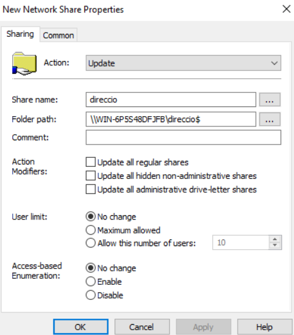

## 3. Control d'Emmagatzematge (FSRM i Quotes NTFS)

El client es queixa que els usuaris guarden fotos personals i omplen el disc. Heu d'actuar:

---

### Quotes NTFS (Control per Volum)

A la unitat de dades, activeu les quotes NTFS des de les propietats del volum.
Establir un límit de 500 MB per defecte per a qualsevol usuari nou.

Anem a les propietats de disc C, i a l’apartat de “Quota”.

Copiem la mateixa configuració per limitar el espai del disc als usuaris.

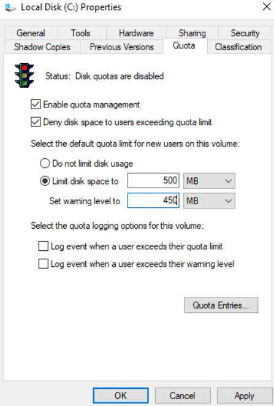

Quan apliquem, ens apareixerà aquest avís, prenem “OK”.

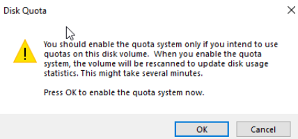

### FSRM (Control per Carpeta)

Instal·leu el rol File Server Resource Manager.
Quota de Carpeta: A la carpeta Public, apliqueu una quota de 200 MB (Hard Quota).
  Configureu un avís al 90% que enviï un missatge personalitzat: "Compte! FoodLogístic
  t'informa que estàs a punt d'esgotar l'espai compartit."
Filtrat de Fitxers: A la carpeta Operacions, creeu un filtre que impedeixi guardar arxius
  executables (.exe, .msi) i fitxers d'àudio o vídeo.

Anem a “File Server Resource Manager”.

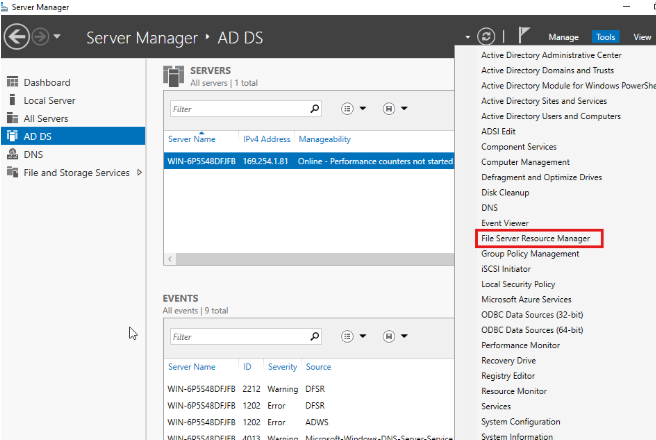

Un cop dintre, anem a “Quota Management” i entrem a la carpeta “Quotas”.

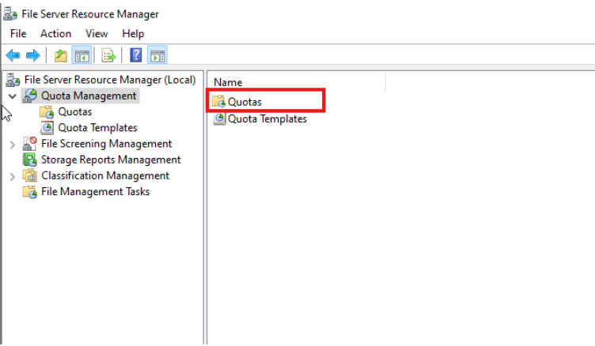

Un cop dintre de la carpeta, prenem “Create Quota”.

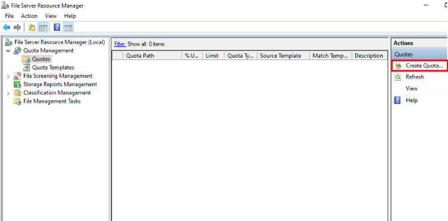

Afegim la ruta de la carpeta i anem a “Custom Properties”.

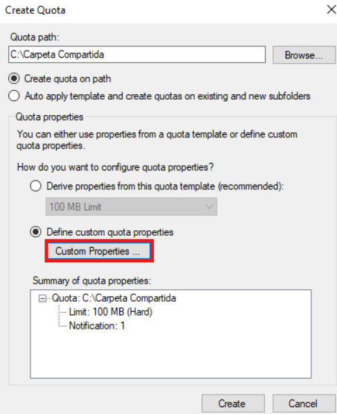

Afegim el límit i prenem “Add”.

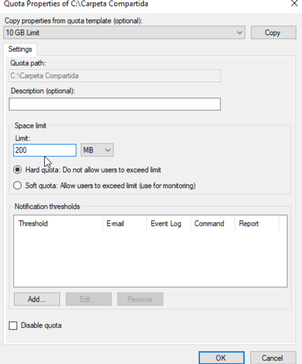

Posem 90% del espai perquè generi la notificació, anem a “Event Log” i afegim el missatge  
personalitzat:

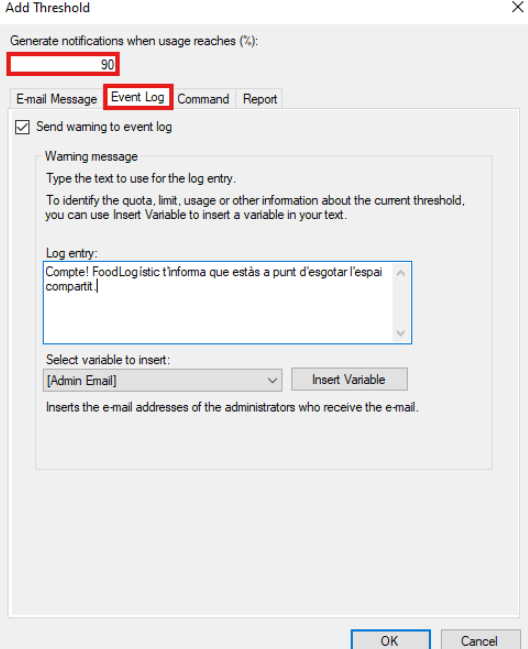

Filtrat de Fitxers: A la carpeta Operacions, creeu un filtre que impedeixi guardar arxius
  executables (.exe, .msi) i fitxers d'àudio o vídeo.

Entrem a l’arxiu d’abans i creem:

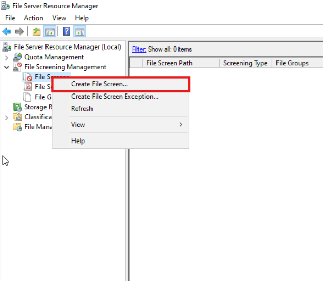

Possem la ruta i anem a “Custom Properties”.

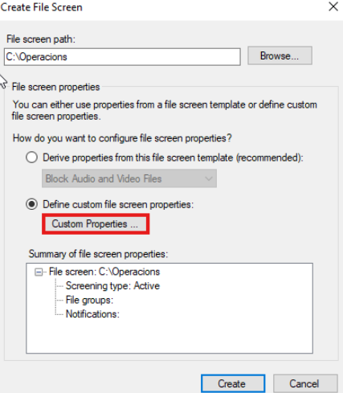

Seleccionem aquestes dues opcions:

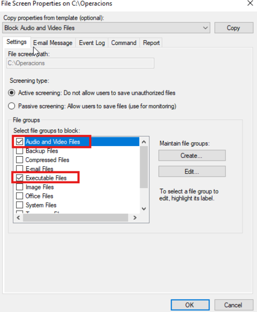

Creem el filtratge i seleccionem la opció de “Save the custom file screen without creating a  
template”.

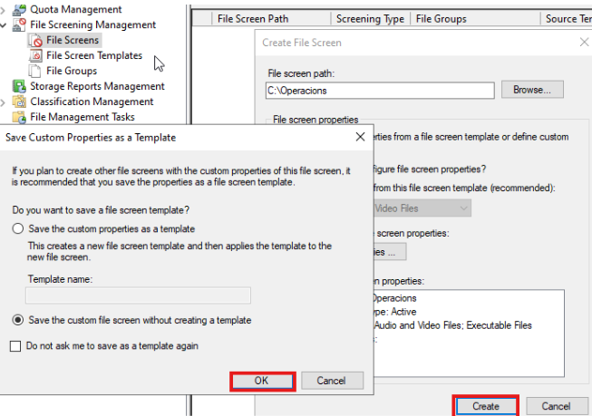

## 4. Verificació i Auditoria

Connecteu-vos des d'un client Windows 10/11 i comproveu:

Verifiqueu l’accés i la visibilitat dels recursos per un usuari de cada grup.

Usuari Biel Pérez (Transport):

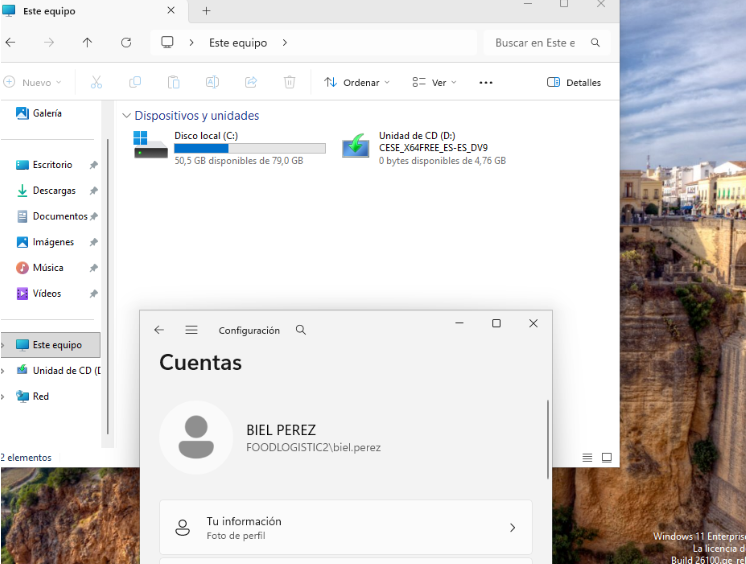

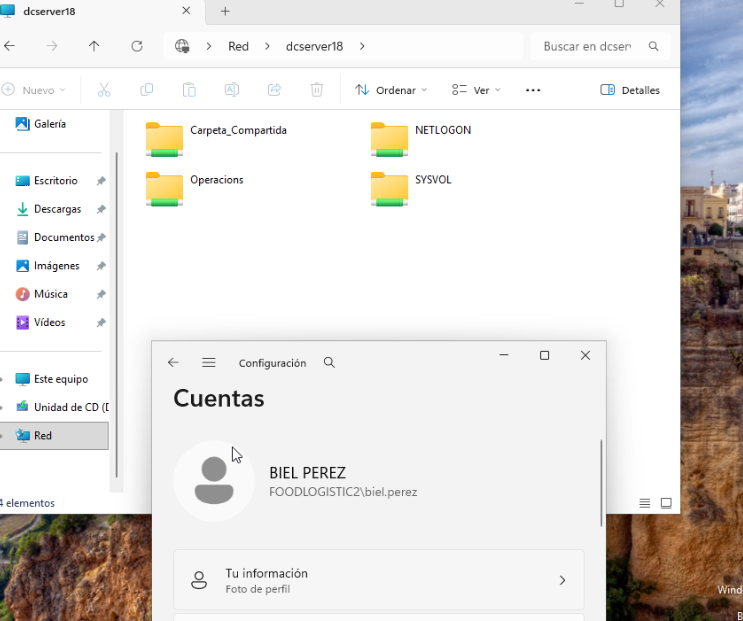

Usuari Pol Hernández:

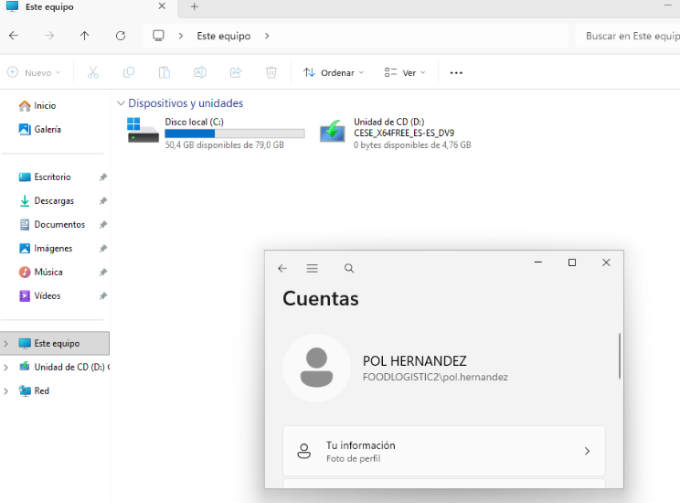

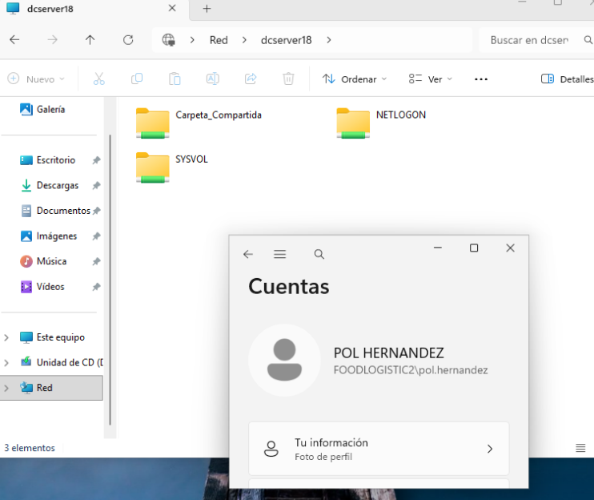

Usuari Pau Martínez (Direcció):

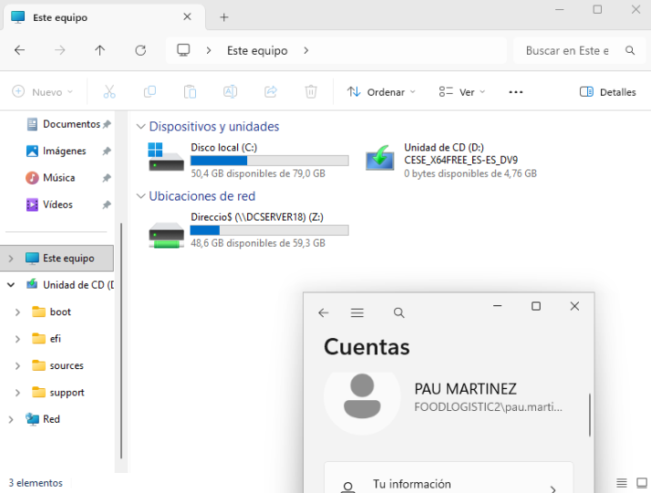

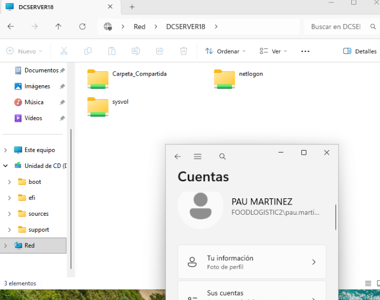

Què passa si intenteu copiar un .exe a Operacions?

Que no hi ha accés per poder copiar-ho


Si canvieu l'extensió d'un executable a .txt, el servidor el deixa passar? (Proveu el filtratge actiu).


---

[Torna al enunciat](README.md)

[Torna a la pàgina principal](../README.md)