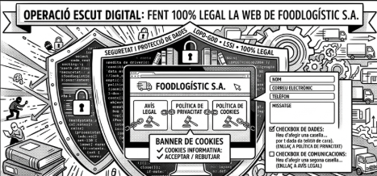

# T06: Operació Escut Digital: Fent 100% legal la web de FoodLogístic S.A.

## Introducció al cas

En una activitat anterior (**T02**) ja has fet la teva proposta de millora per a la presència a Internet de **FoodLogistic S.A.**. Ara toca anar un pas més enllà i adaptar la pàgina a les diferents normatives que regulen les pàgines web d’empreses i organitzacions.

## Descripció de l'activitat

Has de modificar la **landing page** de l'empresa **FoodLogístic S.A.** creada anteriorment i assegurar-te que compleixi els següents requisits legals i tècnics:

- **Avís legal:** cal crear i enllaçar una pàgina d’avís legal on s’informi de la identitat del responsable del tractament de les dades, la finalitat del tractament, els drets dels interessats i les mesures de seguretat adoptades.
- **Política de privacitat:** cal incloure un apartat detallat que expliqui les bases legals del tractament, els destinataris de les dades, el temps de conservació i com exercir els drets **ARSLOP** (**accés, rectificació, supressió, oposició, limitació i portabilitat**).
- **Política de cookies:** cal informar de quines cookies s’utilitzen, la seva finalitat, durada i com acceptar-les o rebutjar-les.
- **Banner de cookies:** ha d’informar el visitant de l’existència de cookies i demanar-li el seu consentiment.
- **Consentiment en el formulari:** el formulari de contacte ha de recollir **nom**, **correu electrònic**, **telèfon** i **missatge**.
- **Checkbox de dades:** heu d’afegir una casella de selecció (**checkbox**) obligatòria i desmarcada per defecte per demanar el consentiment exprés per al tractament de les dades. Aquesta casella ha d’enllaçar a la **política de privacitat**.
- **Checkbox de comunicacions:** heu d’afegir una segona casella de selecció, desmarcada per defecte, per autoritzar l’enviament de comunicacions comercials. Aquesta casella ha d’enllaçar a l’**avís legal**.

És important que totes les modificacions i les noves pàgines mantinguin el **disseny** i l’**estil original** de la web corporativa.

## Què cal lliurar

Al repositori del projecte, dins del **`README.md`** que descriu aquesta activitat, incorpora un enllaç a la **URL** de la web desplegada a **GitHub Pages**.

## Materials i enllaços de suport

- **Moodle 0226. Seguretat Informàtica. RA5**
- **Document amb les dades de FoodLogistic S.A.**

---

[Link de la pàgina web](https://paumartinezs.github.io/FoodLogistic-Pau/)

[Torna a la pàgina principal](../README.md)