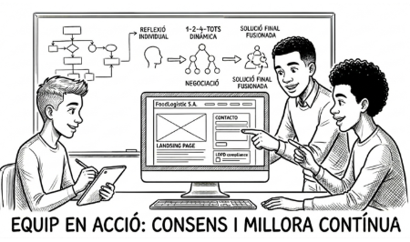

# T08: Tria de la web definitiva

## Introducció

Benvinguts a una de les fases més importants d'aquest projecte. Com a integrants de la vostra pròpia empresa de serveis informàtics, ha arribat el moment de demostrar que sabeu treballar en equip per oferir solucions professionals.

Fins ara, cadascú de vosaltres ha estat treballant de manera individual en el disseny de la pàgina web. Ara bé, el client no vol rebre diferents propostes d'una mateixa empresa; **FoodLogístic S.A.** espera una **solució única, consensuada i professional** que s'inclogui a la memòria tècnica final.

Per tal d'evitar triar una proposta a cegues o sense criteri, aplicarem una dinàmica de treball en equip per fomentar la participació de tothom. Aquest procés us servirà per:

- reflexionar individualment sobre els encerts del vostre propi disseny
- posar en comú les idees amb la resta de companys de l'equip
- compartir els vostres descobriments i negociar per arribar a un consens
- desenvolupar habilitats transversals imprescindibles en el món laboral real, com la **comunicació assertiva**, la **col·laboració** i la **creativitat**

Recordeu que el vostre objectiu com a socis de l'empresa informàtica és defensar una proposta guanyadora que convenci el client, sigui tècnicament viable i compleixi totes les exigències legals.

## Descripció de l’activitat

### Pas 1: Reflexió individual

Cadascun de vosaltres ha d’analitzar individualment la web corporativa que ha creat per al client.

Redacteu una petita llista amb els **punts forts** i els **punts febles** de la vostra pròpia proposta segons el que demana el client.

### Pas 2: Debat i contrast d’idees

Ara els membres de l’equip us reuniu per explicar les reflexions individuals de les vostres propostes.

Durant aquesta fase, és obligatori que:

- defenseu els vostres arguments
- procureu posar en pràctica la **comunicació assertiva**
- escolteu els arguments dels companys

### Pas 3: Negociació i consens final

Després d'avaluar les diferents propostes, els integrants de l'equip heu d'entrar en una fase de negociació per triar la **web definitiva**.

No podeu prendre la decisió de manera arbitrària; s'ha d'arribar a un acord per decidir quina solució es presentarà.

Sigueu creatius: si ho preferiu, podeu decidir **fusionar el millor de cada web** (per exemple, el formulari d'un i el disseny d'un altre) per crear la proposta final perfecta.

## Què cal lliurar

Un document amb:

- les **reflexions individuals**
- un **breu informe del procés de negociació**
- la descripció del **consens assolit**
- la **justificació de la tria**

## Materials i enllaços de suport

- **Què és la comunicació assertiva**
- [https://github.com/SMX2n/Projecte7-GitHubPages](https://github.com/SMX2n/Projecte7-GitHubPages)

---

A l'arxiu [solucio.md](solucio.md) hi ha la solució de la Tasca08

[Torna a la pàgina principal](../README.md)